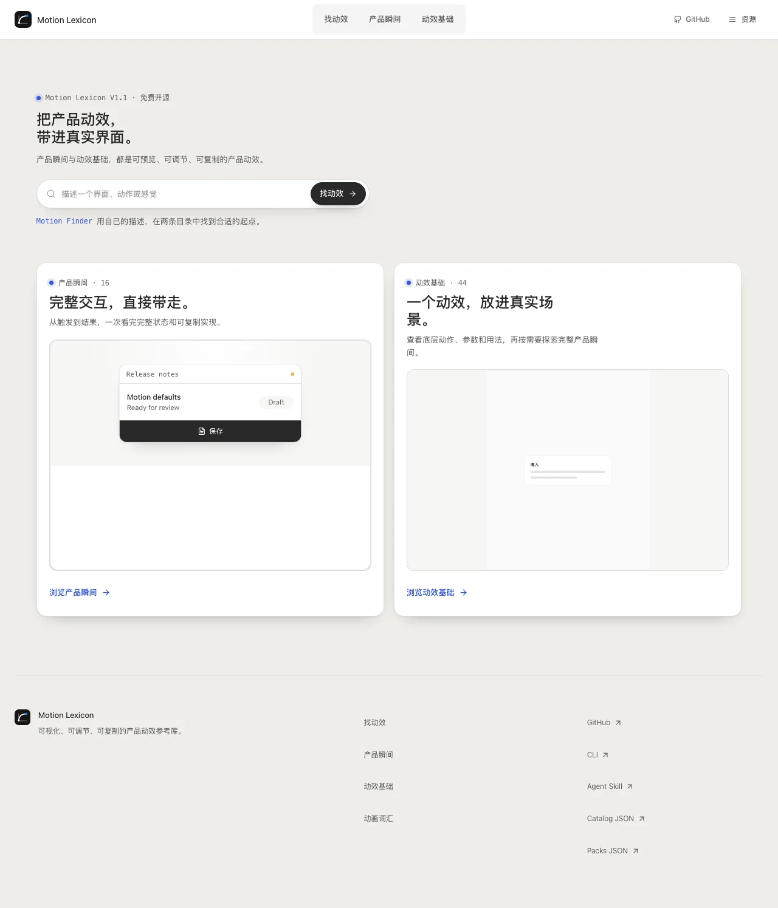
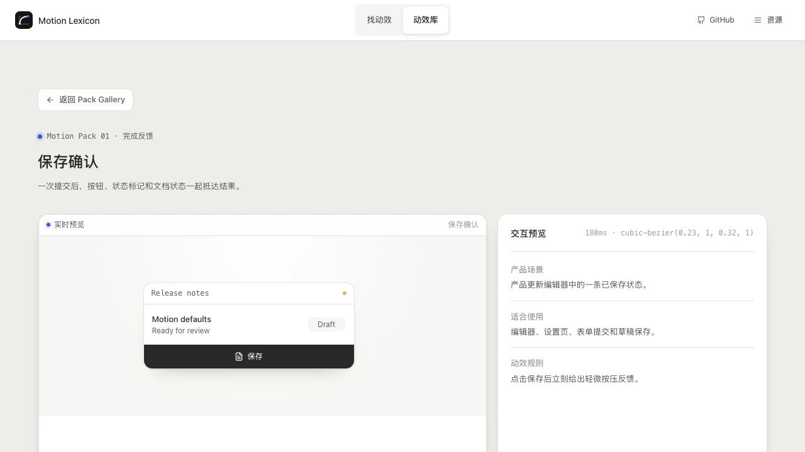

<!-- markdownlint-disable MD013 MD033 MD041 -->

<p align="center">
  
</p>

<h1 align="center">Motion Lexicon</h1>

<p align="center">
  <a href="./README.md"><strong>English</strong></a> ·
  <a href="./README.zh-CN.md">简体中文</a>
</p>

<p align="center"><strong>Copy a product moment or motion primitive into your interface.</strong></p>

<p align="center">
  A free, open-source motion system for builders, designers, developers, and AI agents.<br />
  <strong>Product moments · Motion primitives · Finder</strong>
</p>

<p align="center">
  <a href="https://motion-lexicon.pages.dev/en/packs/"><strong>Explore Product Moments</strong></a> ·
  <a href="https://motion-lexicon.pages.dev/en/catalog/"><strong>Explore Motion Primitives</strong></a> ·
  <a href="https://motion-lexicon.pages.dev/en/finder/"><strong>Use Motion Finder</strong></a> ·
  <a href="https://motion-lexicon.pages.dev/en/"><strong>Visit the Website</strong></a>
</p>

<p align="center">
  <a href="https://github.com/Ryan-yang125/motion-lexicon/actions/workflows/ci.yml"></a>
  <a href="./LICENSE"></a>
  <a href="./CONTENT-LICENSE"></a>
</p>

<!-- markdownlint-enable MD013 MD033 MD041 -->



## Two collections, one motion system

V1.1 brings together two equal collections for product motion. **Motion Packs**
are complete product moments; **Motion Primitives** are the 44 focused building
blocks behind interface behavior. Start from the level that matches the work in
front of you, then move between them when you need a fuller implementation or a
more precise adjustment.

| Collection | Best starting point | What you can copy |
| --- | --- | --- |
| [Product Moments · Motion Packs](https://motion-lexicon.pages.dev/en/packs/) | A save, publish, invite, filter, or similar product state | A complete scene, interaction contract, Prompt, HTML, CSS, and JavaScript |
| [Motion Primitives](https://motion-lexicon.pages.dev/en/catalog/) | An entrance, easing curve, sequence, transition, or parameter | A precise live workspace, terminology, parameters, and portable implementation |
| [Motion Finder](https://motion-lexicon.pages.dev/en/finder/) | A feeling or intent without an exact term | Relevant product moments and motion primitives in one search path |

## Motion Packs for real product moments

The first 16 Packs are complete, small interactions that already live inside
recognisable product surfaces. Trigger each Pack in the browser, inspect its
state changes, then copy the Prompt, HTML, CSS, and JavaScript into your own
product.

Every Pack carries one clear interaction contract:

- A real product context with a visible before-and-after state
- Immediate press and completion feedback
- Short, compositor-friendly timing built from `transform` and `opacity`
- A portable implementation plus reduced-motion treatment
- A stable, shareable detail URL



### The first 16 Packs

| Group | Motion Packs |
| --- | --- |
| Feedback | Save confirmation, Publish release, Share link, Inline validation |
| Choice | Card selection, Workspace switch, Template choice, Command menu |
| Change | Layer insertion, Archive undo, Filter results, Details disclosure |
| Workflow | Notification triage, Progress steps, Member invite, Media scrub |

Start with the [Motion Pack gallery](https://motion-lexicon.pages.dev/en/packs/),
then open a detail such as [Save confirmation](https://motion-lexicon.pages.dev/en/packs/save-confirmation/).

## One interaction, end to end

1. **Preview** a complete product moment in its own scene.
2. **Trigger** it yourself and see the state changes in context.
3. **Inspect** the timing, interaction guidance, and reduced-motion behavior.
4. **Copy** the Prompt or portable HTML, CSS, and JavaScript.

The gallery and every Pack detail are static pages. They load fast, work without
an account, and stay easy to share in a design review, issue, or agent task.

## Connected through Finder and related motion

Motion Finder spans both collections. Pack detail pages surface the motion
primitives that shape each product moment; primitive workspaces surface product
moments for their declared Pack relationships. This creates one continuous
motion system while preserving the different jobs each collection serves.

| Surface | What it gives you |
| --- | --- |
| [Motion Packs](https://motion-lexicon.pages.dev/en/packs/) | 16 complete, copy-ready product interactions |
| [Motion Finder](https://motion-lexicon.pages.dev/en/finder/) | Explainable candidates from a natural-language motion request |
| [Motion Primitives](https://motion-lexicon.pages.dev/en/catalog/) | 44 canonical motion workspaces across 12 families |
| [Vocabulary](https://motion-lexicon.pages.dev/en/vocabulary/) | 91 bilingual terms with definitions and close-term distinctions |
| [Versioned data](https://motion-lexicon.pages.dev/data/v1/packs.json) | Machine-readable Packs, catalog, vocabulary, and schema |

Finder helps you find the right motion language, product moment, or both. The 44
canonical workspaces and all 91 source terms remain available for exact search,
SEO, and deeper implementation reference.

## Use it from the browser, CLI, or an agent

The website is the fastest visual route. The free CLI exposes the same V1.1
collections through parallel `packs` and `list` commands:

```bash
npx -y github:Ryan-yang125/motion-lexicon#v1.1.0 packs \
  --locale en --format json

npx -y github:Ryan-yang125/motion-lexicon#v1.1.0 pack save-confirmation \
  --locale en --format bundle

npx -y github:Ryan-yang125/motion-lexicon#v1.1.0 list \
  --locale en --format json
```

Primitive discovery and export remain available through the same CLI:

```bash
npx -y github:Ryan-yang125/motion-lexicon#v1.1.0 recommend \
  "A card enters quickly, then settles into place" \
  --locale en --format json

npx -y github:Ryan-yang125/motion-lexicon#v1.1.0 search \
  "shared element" --locale en
npx -y github:Ryan-yang125/motion-lexicon#v1.1.0 export spring \
  --locale en --format bundle
```

Install the free Motion Lexicon Agent Skill:

```bash
npx skills add Ryan-yang125/motion-lexicon --skill motion-lexicon
```

Agents can also read the public resources directly:

- [llms.txt](https://motion-lexicon.pages.dev/llms.txt)
- [llms-full.txt](https://motion-lexicon.pages.dev/llms-full.txt)
- [Motion Packs JSON](https://motion-lexicon.pages.dev/data/v1/packs.json)
- [Catalog JSON](https://motion-lexicon.pages.dev/data/v1/catalog.json)
- [Vocabulary JSON](https://motion-lexicon.pages.dev/data/v1/vocabulary.json)
- [JSON Schema](https://motion-lexicon.pages.dev/data/v1/schema.json)

## Free, open, and portable

Motion Lexicon is a static website with free browser access, a local CLI, an
Agent Skill, and public data. Every exported implementation is framework
independent, so it can travel into an existing product stack.

- Source code: [MIT](./LICENSE)
- Project-authored content and data: [CC BY 4.0](./CONTENT-LICENSE)
- Generated code fragments: [0BSD](./CONTENT-LICENSE)
- Interaction primitives: [Interior](https://github.com/ddoemonn/interior),
  adapted under MIT with attribution in [NOTICE](./NOTICE)

## V1.1 snapshot

**V1.1.0 is live.** The public product includes two equal collections: 16 real
product Motion Packs and 44 canonical Motion Primitives. Finder, the bilingual
vocabulary, CLI, Agent Skill, versioned machine-readable data, localized SEO,
and static delivery connect the full system.

<!-- markdownlint-disable MD013 MD033 -->

<details>
<summary><strong>Engineering reference for contributors</strong></summary>

### Core routes

Every public product route is available in English (`/en/`) and Chinese
(`/zh/`).

| Route shape | Purpose |
| --- | --- |
| `/:locale/` | Product home with equal routes into both collections |
| `/:locale/packs/` | All 16 real product Motion Packs |
| `/:locale/packs/:packId/` | A Pack preview, guidance, and portable export |
| `/:locale/finder/` | Natural-language motion recommendation |
| `/:locale/catalog/` | Full 44-workspace Motion Primitives collection |
| `/:locale/vocabulary/` | Complete 91-term vocabulary |
| `/:locale/:category/:recipe/` | Canonical recipe workspace |
| `/data/v1/*.json` | Versioned Pack, catalog, vocabulary, and schema data |

### Build and static delivery

Motion Lexicon uses React, TypeScript, Vite, TanStack Router, and i18next. A
production build runs this sequence:

```text
tsc -b
→ vite build
→ tsx --tsconfig tsconfig.app.json scripts/prerender.ts
```

The prerender step enumerates canonical routes from `src/data/site.ts`, renders
them through `src/entry-server.tsx`, injects localized metadata, and writes
`dist/<route>/index.html`, `dist/sitemap.xml`, and `dist/robots.txt`. The
finished `dist/` directory contains static HTML, CSS, JavaScript, images, and
data for CDN-backed static hosting.

```bash
npm install
npm run dev
npm run build
npm run preview -- --host 127.0.0.1 --port 4173
```

### Quality gates

```bash
npm run lint
npm run typecheck
npm run test
npm run i18n:check
npm run vocabulary:check
npm run seo:check
npm run motion:check
npm run a11y:check
npm run build
npm run bundle:check
npm run crawl:dist
npm run test:visual
```

Product intent and implementation decisions live in [PRODUCT.md](./PRODUCT.md)
and [DESIGN.md](./DESIGN.md). Contribution guidelines are in
[CONTRIBUTING.md](./CONTRIBUTING.md), community participation follows
[CODE_OF_CONDUCT.md](./CODE_OF_CONDUCT.md), and security reports follow
[SECURITY.md](./SECURITY.md).

</details>

<!-- markdownlint-enable MD013 MD033 -->

---

**[Explore Product Moments](https://motion-lexicon.pages.dev/en/packs/)** ·
**[Explore Motion Primitives](https://motion-lexicon.pages.dev/en/catalog/)** ·
**[Use Motion Finder](https://motion-lexicon.pages.dev/en/finder/)** ·
**[阅读中文 README](./README.zh-CN.md)**
