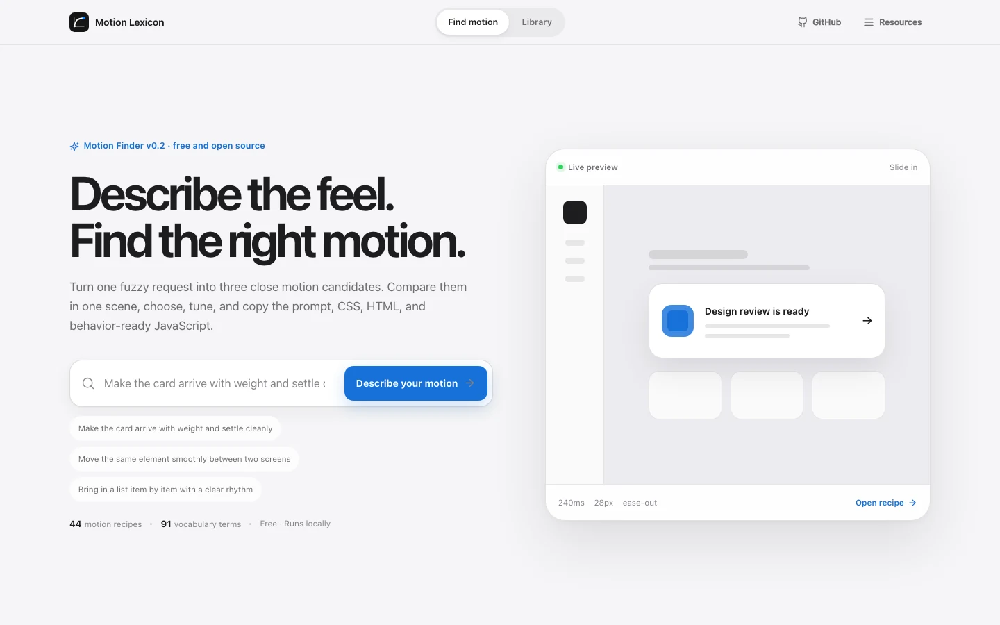
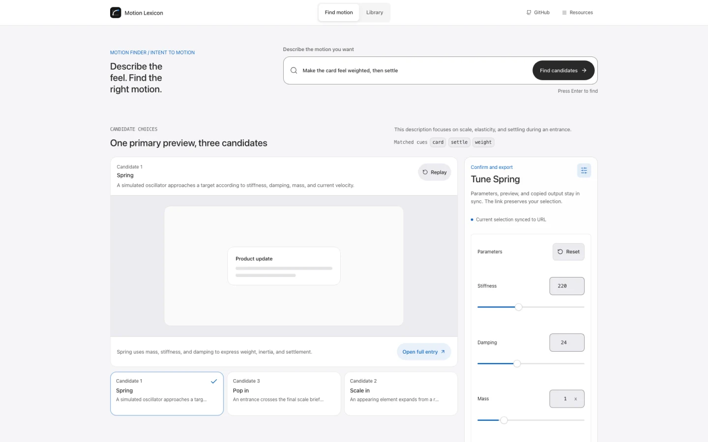
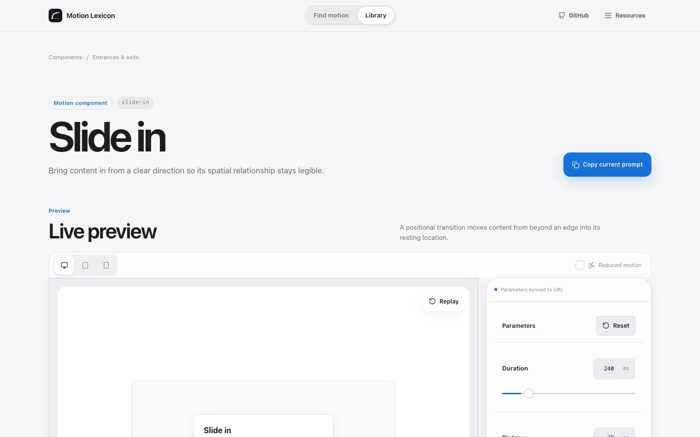

<!-- markdownlint-disable MD013 MD033 MD041 -->

<p align="center">
  
</p>

<h1 align="center">Motion Lexicon</h1>

<p align="center">
  <a href="./README.md"><strong>English</strong></a> ·
  <a href="./README.zh-CN.md">简体中文</a>
</p>

<p align="center"><strong>Describe how motion should feel. Leave with an exact, copy-ready recipe.</strong></p>

<p align="center">
  A free visual motion finder for product builders, designers, developers, and AI agents.<br />
  <strong>Describe → Choose → Tune → Use</strong>
</p>

<p align="center">
  <a href="https://motion-lexicon.pages.dev/en/finder/"><strong>Try Motion Finder</strong></a> ·
  <a href="https://motion-lexicon.pages.dev/en/catalog/"><strong>Explore the Library</strong></a> ·
  <a href="https://motion-lexicon.pages.dev/en/"><strong>Visit the Website</strong></a>
</p>

<p align="center">
  <a href="https://github.com/Ryan-yang125/motion-lexicon/actions/workflows/ci.yml"></a>
  <a href="./LICENSE"></a>
  <a href="./CONTENT-LICENSE"></a>
</p>

<!-- markdownlint-enable MD013 MD033 MD041 -->



## From a vague feeling to a usable motion

Start with the words already in your head:

> “The card should pop in with weight, then settle cleanly.”

Motion Finder turns that request into a focused workflow:

1. **Describe** the feeling, purpose, or behavior in Chinese or English.
2. **Choose** from three ranked static candidates while the current choice plays in one primary preview.
3. **Tune** and replay the selected motion while watching the primary preview update in real time.
4. **Use** the result as an agent-ready prompt or portable HTML, CSS, and JavaScript.

The full state lives in the URL, so a motion decision can be shared with a
teammate or reopened later.



## A visual workbench for every recipe

Each recipe brings the motion, controls, implementation, and design guidance
into one place.

- Large live preview with replay, device, and reduced-motion controls
- Focused Inspector for the parameters that matter most
- Prompt, HTML, CSS, and framework-independent JavaScript generated from one
  motion specification
- Purpose, usage frequency, interaction rules, review criteria, and
  accessibility guidance
- Stable, shareable URLs for every recipe and parameter state



## What you can explore

| Surface | What it gives you |
| --- | --- |
| [Motion Finder](https://motion-lexicon.pages.dev/en/finder/) | Three explainable recommendations from a natural-language request |
| [Motion Library](https://motion-lexicon.pages.dev/en/catalog/) | 44 curated, visual workspaces across 12 motion families |
| [Vocabulary](https://motion-lexicon.pages.dev/en/vocabulary/) | 91 bilingual motion terms with precise definitions and close-term distinctions |
| [Recipe workspaces](https://motion-lexicon.pages.dev/en/entrances/slide-in/) | Live previews, parameters, prompts, portable code, and review guidance |
| [Versioned data](https://motion-lexicon.pages.dev/data/v1/catalog.json) | Structured catalog, vocabulary, and schema for tools and agents |

The 44 canonical workspaces include 31 copy-ready components, 9 focused
playgrounds, and 4 practical guides. All 91 source terms resolve into this
curated surface, keeping discovery broad and implementation focused.

## Who it is for

- **Product builders** who know the desired feeling and want the right motion language
- **Designers** who need a visual reference for comparing close animation patterns
- **Developers** who want concrete parameters and portable implementation code
- **AI agents** that work better with precise prompts, structured data, and
  explicit constraints

## Use it from the browser, CLI, or an agent

The website is the fastest visual path. The free CLI carries the same
recommendation model into a terminal:

```bash
npx -y github:Ryan-yang125/motion-lexicon#v0.2.0 recommend \
  "卡片弹出来要有重量，最后收得住" \
  --locale zh \
  --format json
```

Continue from discovery to implementation:

```bash
npx -y github:Ryan-yang125/motion-lexicon#v0.2.0 search \
  "shared element" --locale en
npx -y github:Ryan-yang125/motion-lexicon#v0.2.0 show spring --locale en
npx -y github:Ryan-yang125/motion-lexicon#v0.2.0 export spring \
  --locale en --format bundle
```

`recommend` returns up to three ranked variants with match reasons,
distinctions, resolved presets, preview URLs, and a shareable Finder URL. The
compatibility field remains named `compareUrl` and preserves candidate order.

Install the free Motion Lexicon Agent Skill:

```bash
npx skills add Ryan-yang125/motion-lexicon --skill motion-lexicon
```

The Skill guides an agent from a vague request through ranked recommendations,
primary-preview selection, parameter choices, accessibility checks, and
implementation output.
Agent integrations can also read:

- [llms.txt](https://motion-lexicon.pages.dev/llms.txt)
- [llms-full.txt](https://motion-lexicon.pages.dev/llms-full.txt)
- [Catalog JSON](https://motion-lexicon.pages.dev/data/v1/catalog.json)
- [Vocabulary JSON](https://motion-lexicon.pages.dev/data/v1/vocabulary.json)
- [JSON Schema](https://motion-lexicon.pages.dev/data/v1/schema.json)

## Free, open, and portable

Motion Lexicon runs as a static website and keeps the complete public product
free of charge. The browser experience, CLI, Agent Skill, catalog data, and
generated output travel easily between people and tools.

- Source code: [MIT](./LICENSE)
- Project-authored content and data: [CC BY 4.0](./CONTENT-LICENSE)
- Generated code fragments: [0BSD](./CONTENT-LICENSE)
- Interaction primitives: [Interior](https://github.com/ddoemonn/interior),
  adapted under MIT with attribution in [NOTICE](./NOTICE)

## Project snapshot

**v0.2.0 is live.** The current release includes the bilingual Finder, 44
canonical workspaces, all 91 source terms, the CLI, the Agent Skill, versioned
machine-readable data, localized SEO, and 120 prerendered canonical routes.

- Finder candidate order, current selection, and non-default recipe parameters
  stay shareable in the URL.
- Preview, parameters, prompt, portable code, and reduced-motion output come
  from one semantic motion specification.
- Light and dark themes, keyboard and pointer interaction, reduced-motion
  behavior, and responsive workspaces ship across the public experience.

<!-- markdownlint-disable MD013 MD033 -->

<details>
<summary><strong>Engineering reference for contributors</strong></summary>

### Core routes

Every public product route is available in English (`/en/`) and Chinese
(`/zh/`).

| Route shape | Purpose |
| --- | --- |
| `/:locale/` | Product home |
| `/:locale/finder/` | Natural-language recommendation, candidate selection, and primary preview |
| `/:locale/catalog/` | Full 44-workspace library |
| `/:locale/vocabulary/` | Complete 91-term vocabulary |
| `/:locale/:category/` | Motion-family discovery page |
| `/:locale/:category/:recipe/` | Canonical recipe workspace |
| `/data/v1/*.json` | Versioned catalog, vocabulary, and schema |

### Build and static delivery

Motion Lexicon uses React, TypeScript, Vite, Motion, TanStack Router, and i18next. A
production build runs this sequence:

```text
tsc -b
→ vite build
→ tsx --tsconfig tsconfig.app.json scripts/prerender.ts
```

The prerender step enumerates canonical routes from `src/data/site.ts`, renders
them through `src/entry-server.tsx`, injects localized metadata, and writes
`dist/<route>/index.html`. It also generates `dist/sitemap.xml`,
`dist/robots.txt`, and static redirect rules. The build also carries favicon
assets, bilingual social images, the web manifest, `404.html`, and static
headers into `dist/`.

The finished `dist/` directory contains static HTML, CSS, JavaScript, images,
and data. It can be served from Cloudflare Pages, Vercel static hosting,
Netlify, or any CDN-backed file server. React server rendering runs during the
build only; production requires no Node server.

```bash
npm install
npm run dev
npm run build
npm run preview -- --host 127.0.0.1 --port 4173
```

### Quality gates

```bash
npm run lint
npm run typecheck
npm run test
npm run i18n:check
npm run vocabulary:check
npm run seo:check
npm run motion:check
npm run a11y:check
npm run build
npm run bundle:check
npm run crawl:dist
npm run test:visual
```

Product intent and implementation decisions live in [PRODUCT.md](./PRODUCT.md)
and [DESIGN.md](./DESIGN.md). Contribution guidelines are in
[CONTRIBUTING.md](./CONTRIBUTING.md), community participation follows
[CODE_OF_CONDUCT.md](./CODE_OF_CONDUCT.md), and security reports follow
[SECURITY.md](./SECURITY.md).

</details>

<!-- markdownlint-enable MD013 MD033 -->

---

**[Describe a motion](https://motion-lexicon.pages.dev/en/finder/)** ·
**[Browse all recipes](https://motion-lexicon.pages.dev/en/catalog/)** ·
**[阅读中文 README](./README.zh-CN.md)**
