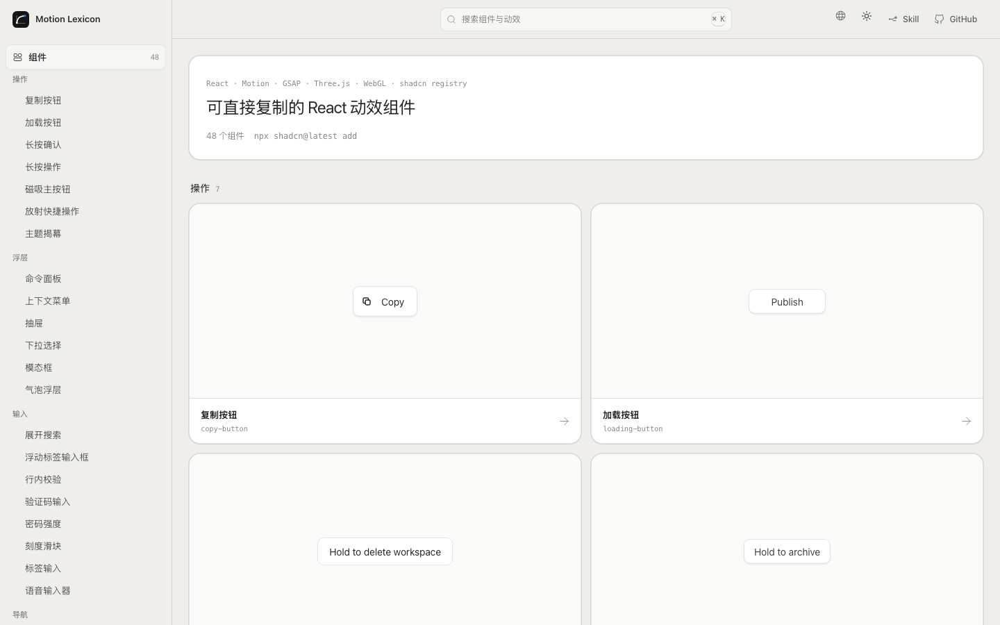
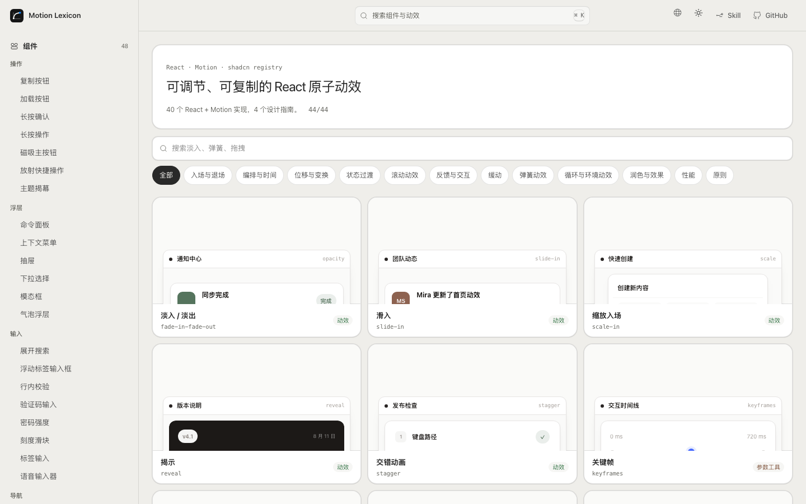
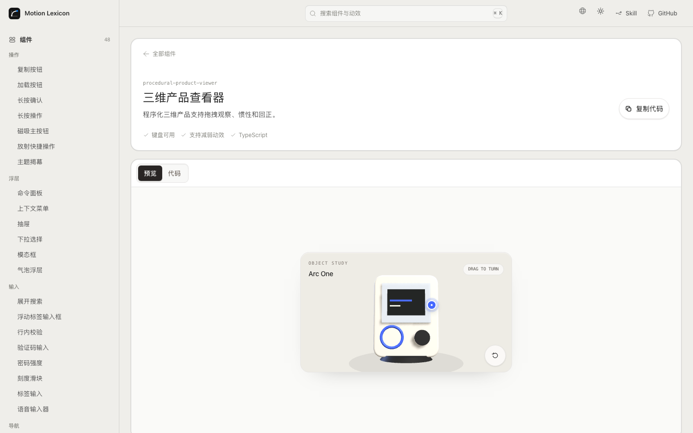
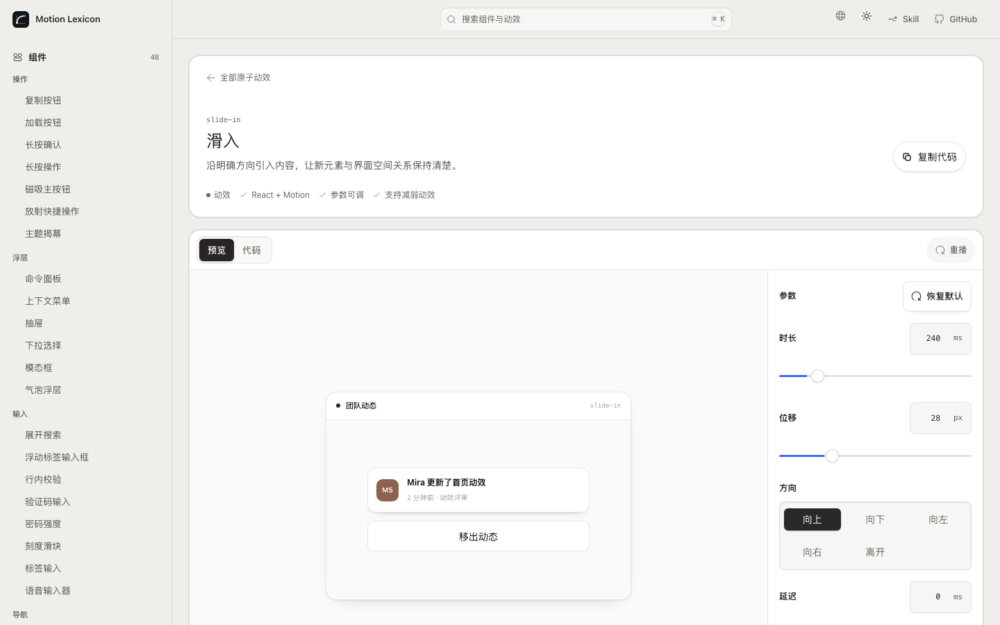

<!-- markdownlint-disable MD013 MD033 MD041 -->

<p align="center">
  
</p>

<h1 align="center">Motion Lexicon</h1>

<p align="center">
  <strong>Copy-ready React motion components and primitives.</strong>
</p>

<p align="center">
  <a href="./README.md"><strong>English</strong></a> · <a href="./README.zh-CN.md">简体中文</a>
</p>

<p align="center">
  <a href="https://motion-lexicon.pages.dev/en/"><strong>Website</strong></a> ·
  <a href="https://motion-lexicon.pages.dev/en/components/"><strong>Components</strong></a> ·
  <a href="https://motion-lexicon.pages.dev/en/primitives/"><strong>Primitives</strong></a> ·
  <a href="https://motion-lexicon.pages.dev/en/skill/"><strong>Agent Skill</strong></a> ·
  <a href="https://motion-lexicon.pages.dev/en/guides/"><strong>Guides</strong></a>
</p>

<p align="center">
  <a href="https://github.com/Ryan-yang125/motion-lexicon/actions/workflows/ci.yml"></a>
  <a href="./LICENSE"></a>
  
  
</p>

<!-- markdownlint-enable MD013 MD033 MD041 -->



## Start from the level you need

| Collection | Use it for | Output |
| --- | --- | --- |
| [Components](https://motion-lexicon.pages.dev/en/components/) | A polished product interaction you can place into a React app | One self-contained TypeScript file through the shadcn registry |
| [Primitives](https://motion-lexicon.pages.dev/en/primitives/) | A precise behavior, timing curve, or motion rule | Live React + Motion preview, tunable props, source, and registry install |
| [Agent Skill](https://motion-lexicon.pages.dev/en/skill/) | Recommendation, composition, implementation, or review inside an agent workflow | A product-aware motion decision and production implementation |

Components and Primitives are parallel collections. A component can combine
several primitives; each component page links back to the underlying motion
decisions.



## Install components and primitives

Every preview demo imports the same Primitive implementation published by the
source view and registry response. There is no generated source-string layer.

```bash
npx shadcn@latest add https://motion-lexicon.pages.dev/r/copy-button.json
npx shadcn@latest add https://motion-lexicon.pages.dev/r/primitive-slide-in.json
```

Add the project registry once to `components.json` for shorter commands:

```json
{
  "registries": {
    "@motion-lexicon": "https://motion-lexicon.pages.dev/r/{name}.json"
  }
}
```

```bash
npx shadcn@latest add @motion-lexicon/copy-button
```

The registry includes 48 complete product and website components spanning
Motion, GSAP, Three.js, native WebGL, SVG, and CSS, plus 40 executable motion
primitives. Four editorial primitives remain design guides. Every installable
item includes TypeScript types, real dependencies, and a reduced-motion path.





## Agent Skill

```bash
npx skills add Ryan-yang125/motion-lexicon --skill motion-lexicon
```

The Skill works in five modes:

- **Recommend** a fitting primitive or component for a product event.
- **Compose** several behaviors into a complete product interaction.
- **Implement** React, HTML, CSS, or JavaScript.
- **Review** rhythm, continuity, interruption, performance, and accessibility.
- **Contribute** a real product request back as a library candidate.

## Project structure

```text
src/registry/components/  React component source of truth
src/registry/demos/       Live product demos
src/registry/primitives/        40 independent React + Motion primitives
src/registry/primitive-demos/   40 real product demos using those primitives
src/registry/primitive-preview-map.tsx  Lazy demo registry
src/data/                 Component, primitive, guide, and SEO content
skills/motion-lexicon/    Agent Skill and motion references
scripts/                  Registry, prerender, SEO, and quality checks
```

Motion Lexicon is a static React + TypeScript application. `npm run build`
generates the app, bilingual prerendered pages, sitemap, public data, and the
shadcn-compatible registry under `/r/`.

```bash
npm ci
npm run dev
npm run build
```

## Quality gates

```bash
npm run lint
npm run typecheck
npm run test
npm run i18n:check
npm run vocabulary:check
npm run seo:check
npm run motion:check
npm run a11y:check
npm run build
npm run bundle:check
npm run crawl:dist
npm run test:visual
```

## License and attribution

- Application and component code: [MIT](./LICENSE)
- Project-authored content: [CC BY 4.0](./CONTENT-LICENSE)
- Interior-derived interaction work: [MIT attribution](./NOTICE)

The component collection builds on interaction principles and MIT-licensed
implementations from [Interior](https://github.com/ddoemonn/interior).
