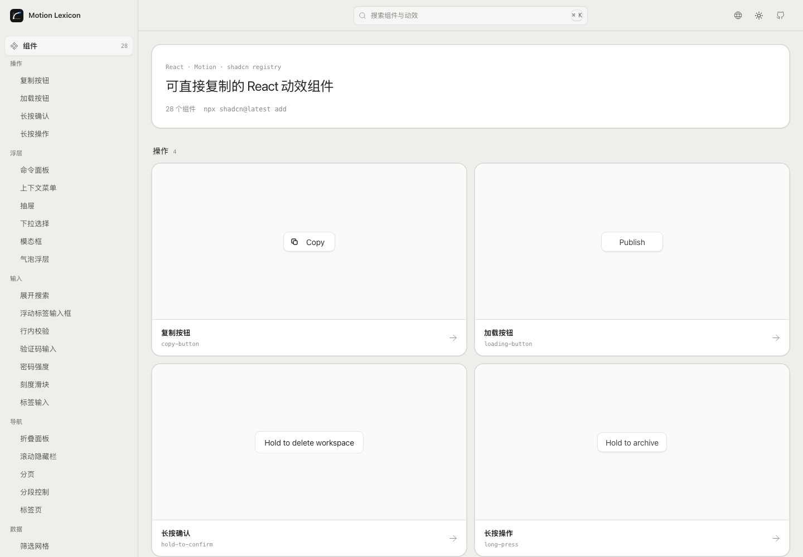
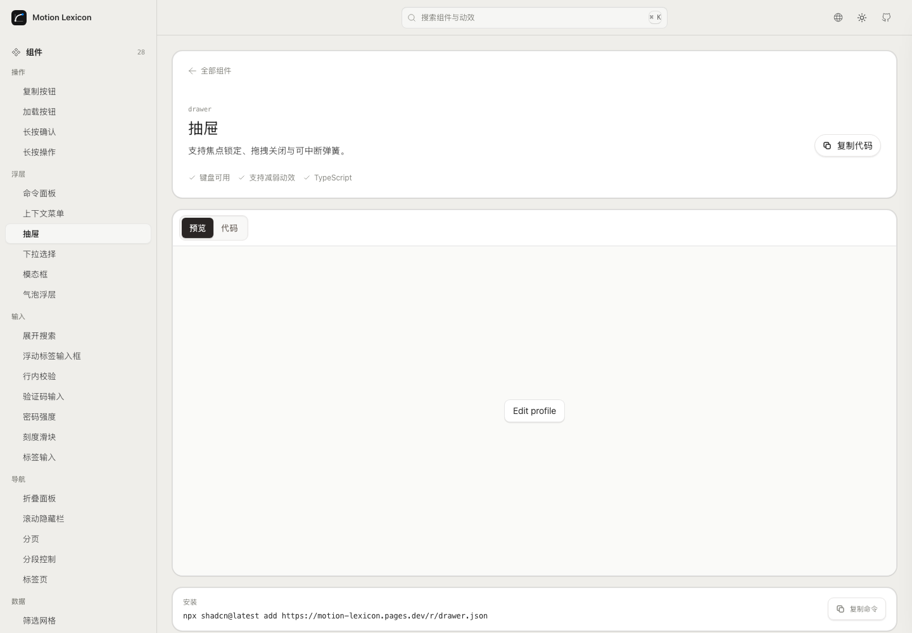

<!-- markdownlint-disable MD013 MD033 MD041 -->

<p align="center">
  
</p>

<h1 align="center">Motion Lexicon</h1>

<p align="center">
  <strong>可直接复制的 React 动效组件，以及可调节的原子动效。</strong>
</p>

<p align="center">
  <a href="./README.md">English</a> · <a href="./README.zh-CN.md"><strong>简体中文</strong></a>
</p>

<p align="center">
  <a href="https://motion-lexicon.pages.dev/zh/components/"><strong>组件</strong></a> ·
  <a href="https://motion-lexicon.pages.dev/zh/primitives/"><strong>原子动效</strong></a> ·
  <a href="https://motion-lexicon.pages.dev/zh/skill/"><strong>Agent Skill</strong></a> ·
  <a href="https://motion-lexicon.pages.dev/zh/guides/"><strong>场景指南</strong></a>
</p>

<!-- markdownlint-enable MD013 MD033 MD041 -->



## 按需要选择层级

| 内容 | 适合场景 | 交付 |
| --- | --- | --- |
| [组件](https://motion-lexicon.pages.dev/zh/components/) | 想把一个精致的产品交互直接放进 React 项目 | 通过 shadcn Registry 安装的单文件 TypeScript 组件 |
| [原子动效](https://motion-lexicon.pages.dev/zh/primitives/) | 需要精确的行为、节奏或动效规则 | 可调预览、提示词、HTML、CSS 和 JavaScript |
| [Agent Skill](https://motion-lexicon.pages.dev/zh/skill/) | 在 Agent 工作流中推荐、组合、实现或审查动效 | 贴合产品场景的动效决策与生产实现 |

组件与原子动效是并列内容。一个组件可以组合多个原子动效，组件详情页会标出对应的底层动效。

## 安装组件

网站预览、源码展示和 Registry 响应共用同一份 React 文件。

```bash
npx shadcn@latest add https://motion-lexicon.pages.dev/r/copy-button.json
```

也可以在 `components.json` 中配置命名空间：

```json
{
  "registries": {
    "@motion-lexicon": "https://motion-lexicon.pages.dev/r/{name}.json"
  }
}
```

```bash
npx shadcn@latest add @motion-lexicon/copy-button
```

28 个组件覆盖操作、浮层、输入、导航、数据和反馈。每个组件都包含 TypeScript 类型、键盘操作、焦点管理、可中断动效和减弱动效方案。



## Agent Skill

```bash
npx skills add Ryan-yang125/motion-lexicon --skill motion-lexicon
```

Skill 支持五种工作模式：

- **推荐**：根据产品事件选择合适的原子动效或组件。
- **编排**：把多个行为组合成完整的产品交互。
- **实现**：输出 React、HTML、CSS 或 JavaScript。
- **审查**：检查节奏、连续性、打断、性能和无障碍。
- **贡献**：把真实产品需求整理成新的内容候选。

## 开发

```text
src/registry/components/  React 组件源码
src/registry/demos/       真实交互预览
src/data/                 组件、原子动效、指南和 SEO 内容
skills/motion-lexicon/    Agent Skill 与动效参考
scripts/                  Registry、预渲染与质量检查
```

项目是静态 React + TypeScript 应用。`npm run build` 会生成网站、中英文静态页面、sitemap、公开数据，以及 `/r/` 下兼容 shadcn 的 Registry。

```bash
npm ci
npm run dev
npm run build
```

## 许可与来源

- 应用与组件代码：[MIT](./LICENSE)
- 项目原创内容：[CC BY 4.0](./CONTENT-LICENSE)
- Interior 衍生交互：[MIT attribution](./NOTICE)

组件集合吸收了 [Interior](https://github.com/ddoemonn/interior) 的交互原则和 MIT 许可实现。
