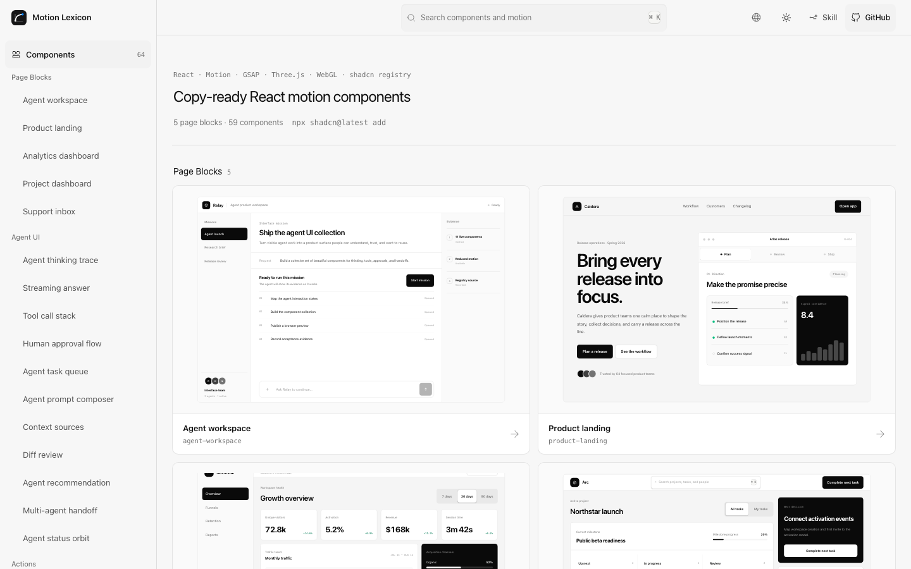
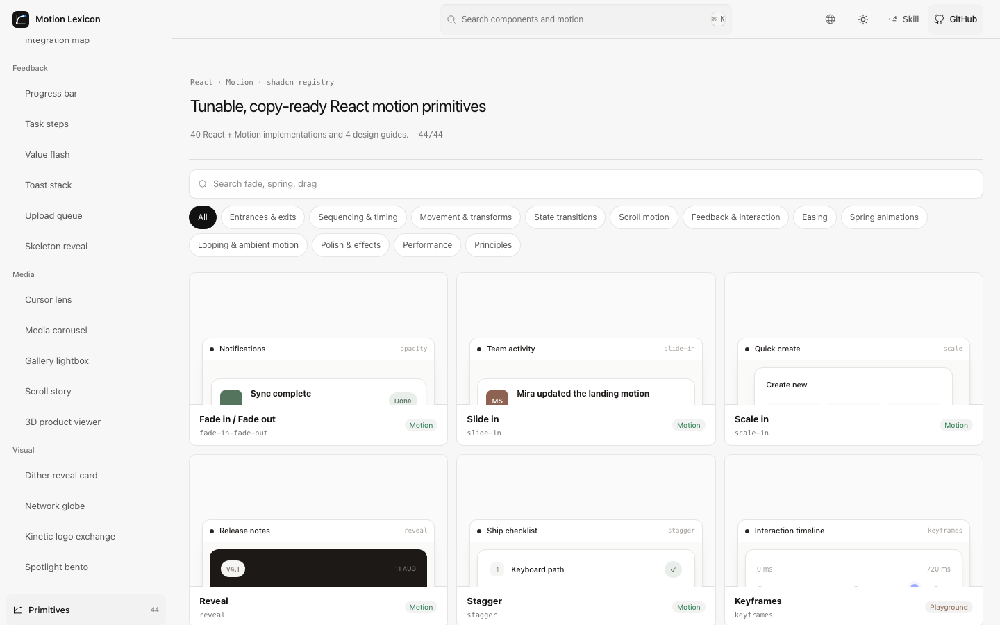
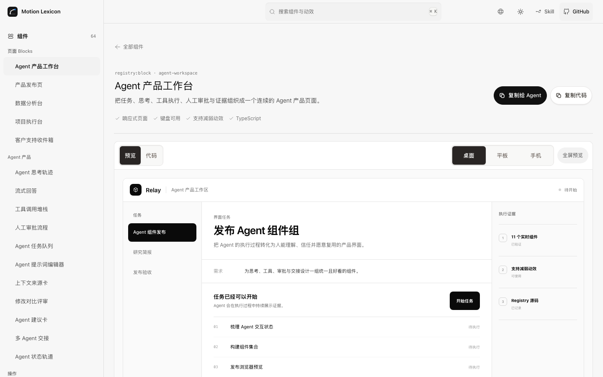
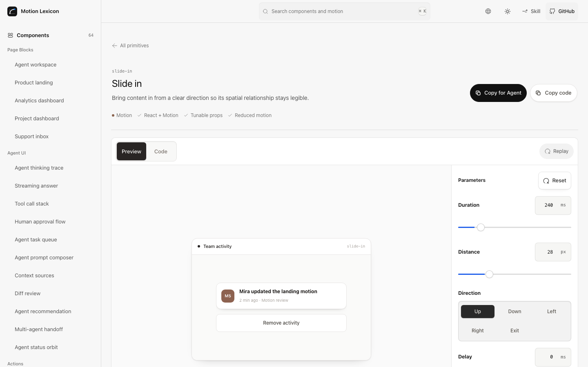

<!-- markdownlint-disable MD013 MD033 MD041 -->

<p align="center">
  
</p>

<h1 align="center">Motion Lexicon</h1>

<p align="center">
  <strong>可直接复制的 React 页面 Block、动效组件与原子动效。</strong>
</p>

<p align="center">
  <a href="./README.md">English</a> · <a href="./README.zh-CN.md"><strong>简体中文</strong></a>
</p>

<p align="center">
  <a href="https://motion-lexicon.pages.dev/zh/"><strong>官网</strong></a> ·
  <a href="https://motion-lexicon.pages.dev/zh/components/"><strong>组件</strong></a> ·
  <a href="https://motion-lexicon.pages.dev/zh/primitives/"><strong>原子动效</strong></a> ·
  <a href="https://motion-lexicon.pages.dev/zh/skill/"><strong>Agent Skill</strong></a> ·
  <a href="https://motion-lexicon.pages.dev/zh/guides/"><strong>场景指南</strong></a>
</p>

<!-- markdownlint-enable MD013 MD033 MD041 -->



## 按需要选择层级

| 内容 | 适合场景 | 交付 |
| --- | --- | --- |
| [页面 Blocks](https://motion-lexicon.pages.dev/zh/components/) | 想预览并直接安装一张完整产品页面 | 通过 shadcn Registry 安装的单文件 TypeScript 页面 |
| [组件](https://motion-lexicon.pages.dev/zh/components/) | 想把一个精致的产品交互直接放进 React 项目 | 通过 shadcn Registry 安装的单文件 TypeScript 组件 |
| [原子动效](https://motion-lexicon.pages.dev/zh/primitives/) | 需要精确的行为、节奏或动效规则 | React + Motion 实时预览、Props 调节、源码与 Registry 安装 |
| [Agent Skill](https://motion-lexicon.pages.dev/zh/skill/) | 在 Agent 工作流中构建完整页面并完成动效决策 | 页面计划、已发布组件组合、生产实现与验收记录 |

组件与原子动效是并列内容。一个组件可以组合多个原子动效，组件详情页会标出对应的底层动效。

V5 将网站主体、5 个页面 Block、Agent UI 集合和初版之后新增的组件统一到同一套黑白灰明暗主题中。



## 安装页面 Block、组件与原子动效

每个预览 Demo 都直接导入对应 Primitive；源码展示与 Registry 发布同一份 Primitive 实现，中间没有字符串源码生成层。

```bash
npx shadcn@latest add https://motion-lexicon.pages.dev/r/product-landing.json
npx shadcn@latest add https://motion-lexicon.pages.dev/r/agent-workspace.json
npx shadcn@latest add https://motion-lexicon.pages.dev/r/agent-thinking-trace.json
npx shadcn@latest add https://motion-lexicon.pages.dev/r/copy-button.json
npx shadcn@latest add https://motion-lexicon.pages.dev/r/primitive-slide-in.json
```

也可以在 `components.json` 中配置命名空间：

```json
{
  "registries": {
    "@motion-lexicon": "https://motion-lexicon.pages.dev/r/{name}.json"
  }
}
```

```bash
npx shadcn@latest add @motion-lexicon/product-landing
```

Registry 包含 5 个完整页面 Block 与 59 个产品、Agent 和网站组件，覆盖 Motion、GSAP、Three.js、原生 WebGL、SVG 与 CSS；同时提供 40 个可运行原子动效，另外 4 个原子条目保留为设计指南。每个可安装条目都包含 TypeScript 类型、真实依赖和减弱动效方案。

Agent UI 集合覆盖思考轨迹、流式回答、工具调用、审批、任务队列、Prompt 输入、上下文来源、Diff 审阅、建议、多 Agent 交接与状态。每个详情页还提供“复制给 Agent”，其中包含预览地址、源码地址、接入要求与验收标准。





## Agent Skill

```bash
# 安装到当前项目
npx skills add Ryan-yang125/motion-lexicon --skill motion-lexicon

# 安装到用户级
npx skills add Ryan-yang125/motion-lexicon --skill motion-lexicon --global

# 只安装到 Codex；需要时把 codex 替换为其他受支持的 Agent ID
npx skills add Ryan-yang125/motion-lexicon --skill motion-lexicon --agent codex
```

使用 `npx skills list` 检查项目安装，使用 `npx skills list --global`
检查用户级安装。项目安装会链接到所选 Agent 的项目 Skill 目录，用户级安装可供
该 Agent 在多个项目中使用。

Skill 支持六种工作模式：

- **构建页面**：从产品任务、精确 Registry 组件与页面计划产出完整页面。
- **推荐**：根据产品事件选择合适的原子动效或组件。
- **编排**：把多个行为组合成完整的产品交互。
- **实现**：输出 React、HTML、CSS 或 JavaScript。
- **审查**：检查节奏、连续性、打断、性能和无障碍。
- **贡献**：把真实产品需求整理成新的内容候选。

## 开发

```text
src/registry/blocks/            5 个 React 页面 Block 源码
src/registry/block-demos/       页面 Block 真实交互预览
src/registry/components/        59 个 React 组件源码
src/registry/demos/             组件真实交互预览
src/registry/primitives/        40 个独立 React + Motion 原子动效
src/registry/primitive-demos/   40 个直接使用原子动效的产品 Demo
src/registry/primitive-preview-map.tsx  懒加载 Demo Registry
src/data/                       组件、原子动效、指南和 SEO 内容
skills/motion-lexicon/          Agent Skill 与动效参考
scripts/                        Registry、预渲染与质量检查
```

项目是静态 React + TypeScript 应用。`npm run build` 会生成网站、中英文静态页面、sitemap、公开数据，以及 `/r/` 下兼容 shadcn 的 Registry。

```bash
npm ci
npm run dev
npm run build
```

## 质量门禁

```bash
npm run lint
npm run typecheck
npm run test
npm run i18n:check
npm run vocabulary:check
npm run motion-grammar:check
npm run skill:check
npm run artifacts:check
npm run seo:check
npm run motion:check
npm run a11y:check
npm run build
npm run bundle:check
npm run crawl:dist
npm run test:visual
```

## 许可与来源

- 应用与组件代码：[MIT](./LICENSE)
- 项目原创内容：[CC BY 4.0](./CONTENT-LICENSE)
- Interior 衍生交互：[MIT attribution](./NOTICE)

组件集合吸收了 [Interior](https://github.com/ddoemonn/interior) 的交互原则和 MIT 许可实现。
